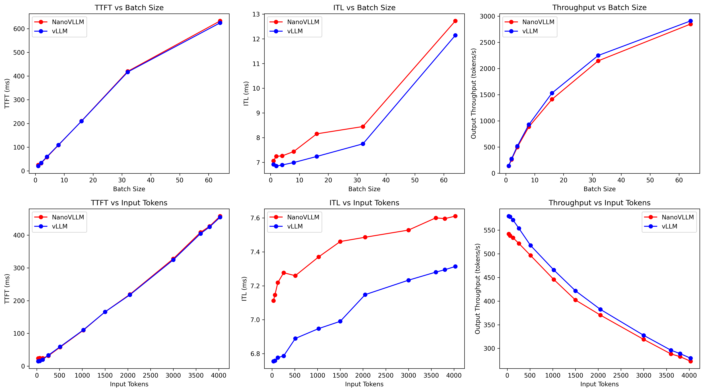

# nanovLLM

Hello! Thanks for taking a look at my educational nanovLLM project. Here's a summary if you're in a hurry! 
This project replicates vLLM's internals, including iterative scheduling, prefix sharing, chunked prefill, paged KV cache management, and non-eager execution via CUDA graph capture. For my model, I replicated Qwen2.5-3B-Instruct's architecture in Pytorch while fusing the weights for QKV projections and SwiGLU up/gate projections. 

When benchmarked against vLLM on an A100, my nanoVLLM was able to achieve comparable Time To First Token (TTFT), while trailing by approximately ~0.3ms - 0.5ms for Inter-Token Latency (90%). You can find an explanation as to why [below](#closing-thoughts).


## How To Use

You can clone this repo with
```
git clone https://github.com/SnorlaxPapa/tiny-vllm.git
cd tiny-vllm
```


**Requirements**

To install key requirements,
```
pip install uv
uv pip install -r requirements.txt --no-build-isolation
```


I have initially omitted FlashAttention2 as it takes very long to compile. Instead, grab a prebuilt wheel [here](https://mjunya.com/flash-attention-prebuild-wheels/). (Note: you need a GPU with compute capability >= 7.5 to use this.) If you're on CUDA <= 12.8 and want to compare against real vLLM as a baseline, you may need to build vLLM from source rather than pip installing it.


**Run nanovLLM**

Before running, please pull a version of Qwen2.5-3B-Instruct from hf with
```
hf download Qwen/Qwen2.5-3B-Instruct --local-dir checkpoints
```
Below is a sample of how to run the model

```
from nanovllm.engine.engine import EngineCore
from nanovllm.sampling_params import SamplingParams

model_path = "checkpoints"
model = EngineCore(model_path, benchmark=False) #set to True for benchmark

prompts = [
    "Hello how are you?",
    "Thank you for reading",
    "I need a job PLEASE",
] #it also accepts tokenized inputs

sampling_params = SamplingParams(temperature=0.8, max_tokens=64)

outputs = model.generate(prompts, sampling_params)
print(outputs[0]) #for response to first prompt
```

## How to benchmark

To benchmark, configure the model path in `nanovllm_benchmark.py` and do 
```
python nanovllm_benchmark.py
```

for a .csv file detailing TTFT, ITL and model throughput.


## Benchmarking 

For nanovLLM, below details the benchmark standardization:

Environment:
- **GPU**: NVIDIA A100
- **CUDA**: 12.8
- **PyTorch version**: 2.11.0
- **Python**: 3.13.15
- **Batch Size benchmark**: `[1, 2, 4, 8, 16, 32, 64]` at `sequence_length=512`
- **Sequence Length benchmark**: `[32, 64, 128, 256, 512, 1024, 1500, 2048, 3000, 3600, 3800, 4030]` at `batch_size=4`
- **Metrics**: Time To First Token (TTFT), Inter-Token Latency(ITL), Throughput

### Results



## Closing Thoughts

- Overall, the nanovLLM inference engine was able to match vLLM across different batch sizes and sequences for both TTFT and throughput
- However, there was an approximately 0.3–0.5 ms gap for ITL.
- I hypothesize that this is primarily due to the nature of the scheduler I built. Paired with its homogenous structure (only prefill, or only decode), it prioritizes prefill requests, meaning once the engine has completed the prefill of a sequence, it will not go on to decode it until all other sequences have been prefilled.
- This leads to a fast TTFT as the first token is produced once prefill is decoded, and each sequence gets to their turn quickly.
- However, this also means that decode requests are stalled, and the time between the first token being generated and the second token being generated is significant enough for there to be a gap in ITL.
- If I were to prioritize decode, it would conversely favour ITL while TTFT will increase as prefilled sequences are decoded first before the scheduler moves onto prefill other sequences. 
- On the contrary, vLLM's scheduler is likely non-homogenous, and is able to mix both decode and prefill requests, which complements well with iterative scheduling, allowing it both fast TTFT and ITL speeds.


## Acknowledgments

This project is inspired by [nano-vllm](https://github.com/GeeeekExplorer/nano-vllm), which implements a minimal vLLM-style inference engine. Architecture and scheduling design closely follow their approach.


